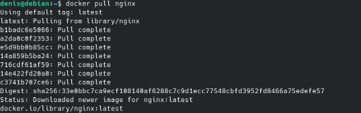
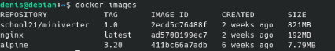
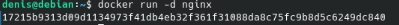
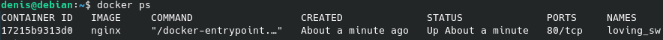
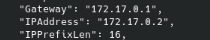
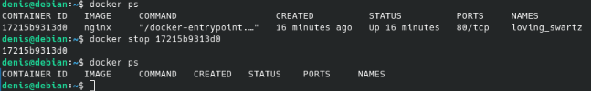
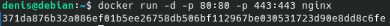
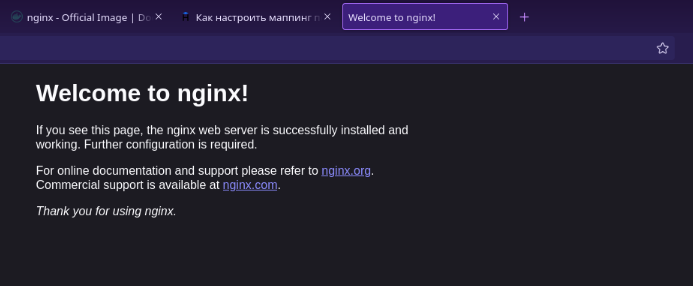
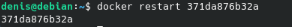
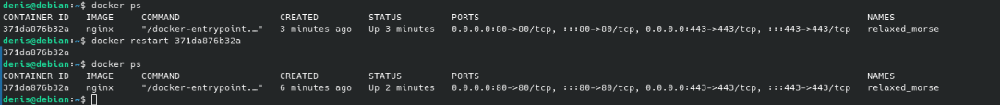

## Part 1. Готовый докер

1) Возьми официальный докер-образ с **nginx** и выкачай его при помощи `docker pull`:

2) Проверь наличие докер-образа через `docker images`:

3) Запусти докер-образ через `docker run -d [image_id|repository]`:

4) Проверь, что образ запустился через `docker ps`:

5) Посмотри информацию о контейнере через `docker inspect [container_id|container_name]`:

Размер контейнера:

Список замапленных портов:

IP контейнера:

6) Останови докер образ через `docker stop [container_id|container_name]`:
   Проверь, что образ остановился через `docker ps`:

7) Запусти докер с портами 80 и 443 в контейнере, замапленными на такие же порты на локальной машине, через команду *run*:
   Проверь, что в браузере по адресу *localhost:80* доступна стартовая страница **nginx**:

8) Перезапусти докер контейнер через `docker restart [container_id|container_name]`:

9) Проверь любым способом, что контейнер запустился:

## Part 2. Операции с контейнером